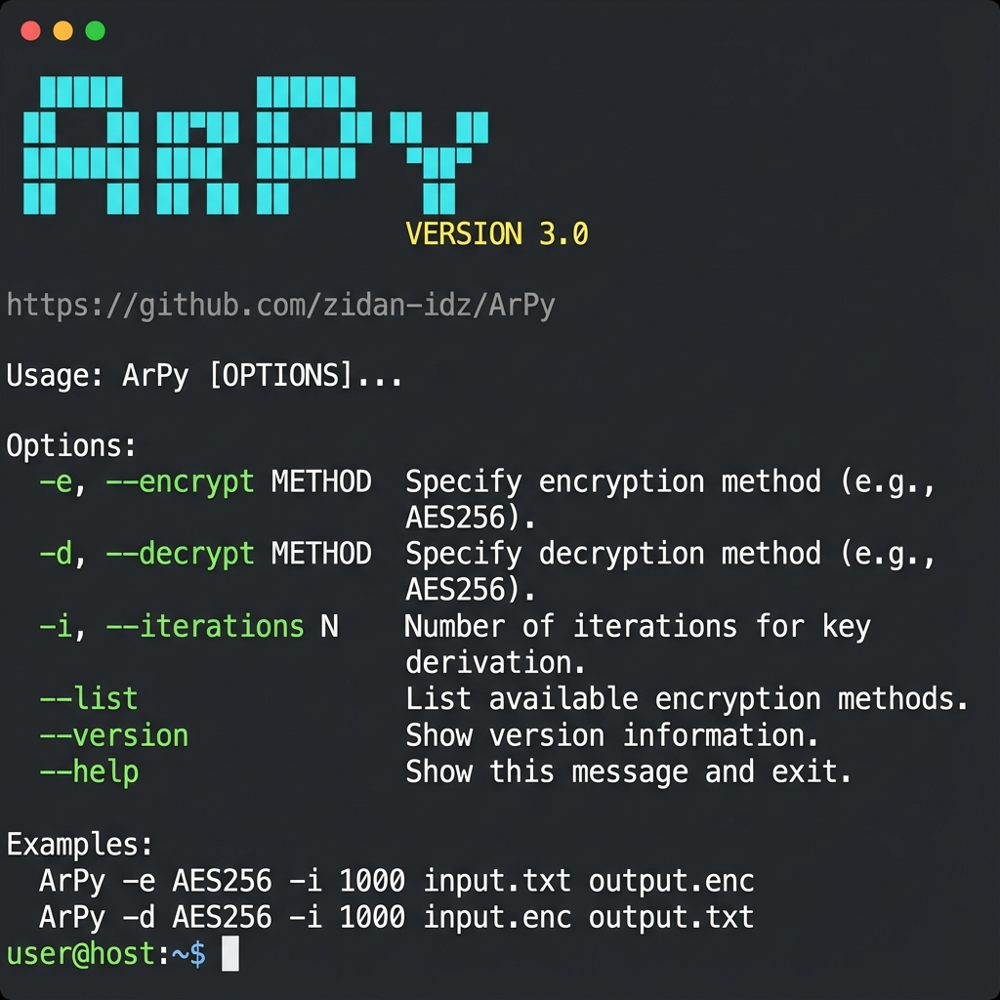
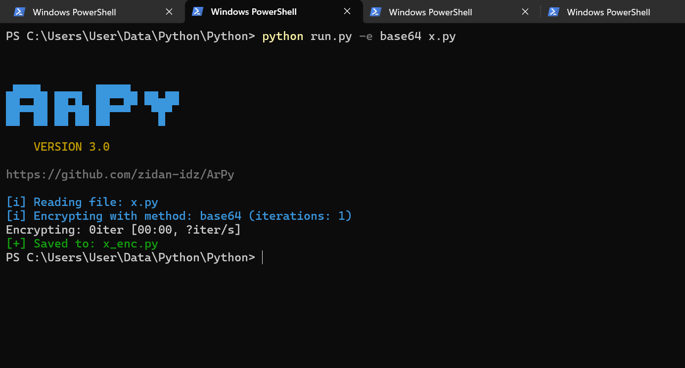

# ArPy Documentation

## Screenshots

### 1. Help Menu


The help menu shows all available commands and options.

### 2. Usage Example


Example of encrypting a file with progress bar.

## Command Examples

### Basic Encryption
```bash
python run.py -e base64 script.py
```

### Multi-iteration Encryption
```bash
python run.py -e marshal -i 10 script.py
```

### Decryption
```bash
python run.py -d auto encrypted.py
```

### List Methods
```bash
python run.py --list
```

## Output Files

All output files are saved in the `docs/` directory:
- `banner.png` - ArPy banner and help menu
- `usage_example.png` - Encryption example with progress bar
- `help_output.txt` - Full help text
- `list_output.txt` - List of all methods
